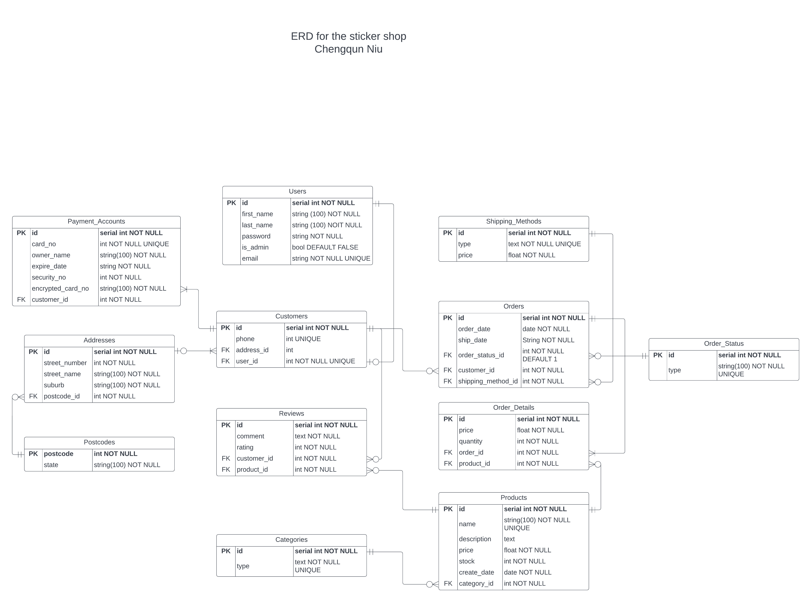
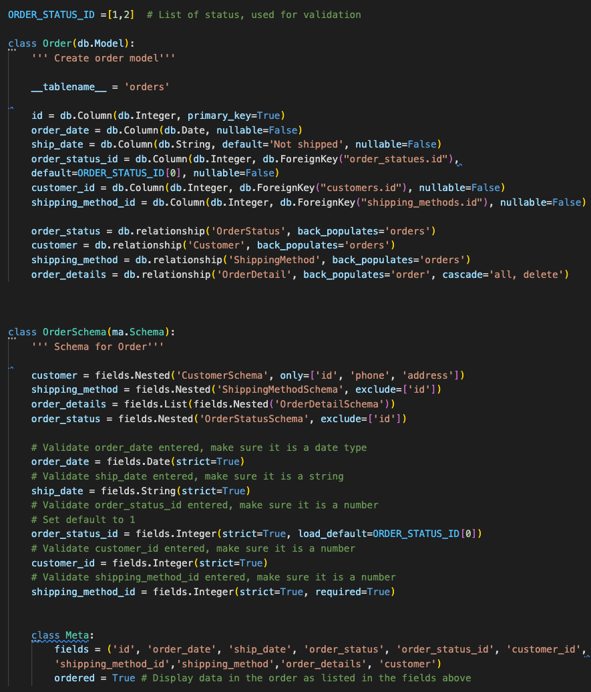
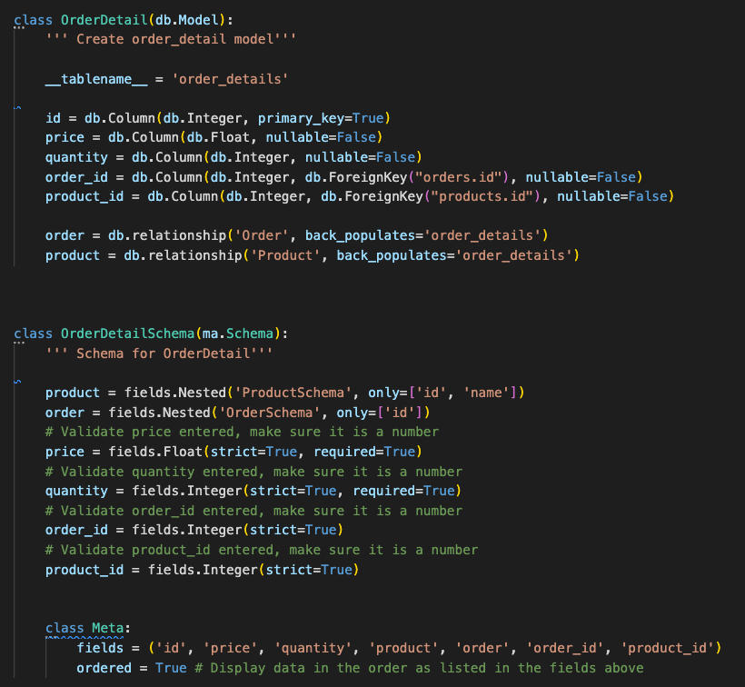
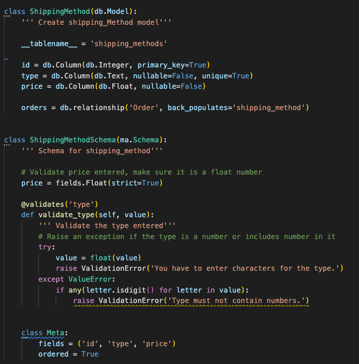

# T2A2

## Problem identified and why needs to be solved:

---

I am trying to build a web application for the sticker shop. The aim of this app is to provide solutions for the sticker shop to manage the information of their customers, products and orders and reviews. And also allows customers to update their personal information and check their order histories.

### Reasons for building this web application:

* Store Information
  
  At the beginning, a sticker shop might only have a small number of customer, product, order and review. Owner could easily use traditional methods such as excel files or notebooks to store these information. As the shop grows, the number of customers, products, orders and reviews grows as well. These methods could still be used to store information, but the size of excel file will become really big or the owner needs to used lots of notebooks to store these information, which makes these methods inefficient and difficult to use. Therefore, the shop needs new methods to store these information.
 
* Manage Information

  As mentioned above, with small number of information, it is easy to find a particular piece of information and update it. As the number grows, it is hard to locate and update particular information.

* Link Information
  
  A sticker shop needs to link all information together. For example, a reivew needs to be linked to a particular customer and product. With the traditional methods mentioned above, if the owner wants to find the order of a customer, the owner needs to search the customer in the customer file and find out the related review ids. Then use ids to find out the corresponding reviews in the review file. This process is complicated and time consuming.

* Allow customer to manage their own information

  With the traditional methods, customers can not manage and upate their information on their own. They are also not able to check their personal order hisotry. Customers needs to contact the owner to perform these operations, which reduces the customer experiece of the sticker shop.

* Benefits of the app

  With the web app, all of the information are stored in the databse which allows owner to easily manage the information. Customers could also create their own account, update their personal information and check their order history by themselves.

## PostgreSQL and Why

---

I am going to use postgresql for this web application. PostgreSQL is a widely used object-relational database management system for flask applications. It supports both relational and non-relational queries.

### The advantages of the postgresql are: reference[1,2,3,4,5,6]

---

* It supports various data types, such as integer, numeric, string, boolean, geometric types, and non-relational data like JSON and XML. PostgreSQL also supports lots of SQL syntaxes.
* It is highly extensible. Users could extend the database by adding features they need, defining own functions and adding own data types.
* It has good scalability. Developers can use it for either small projects or large applications. When business grows, the software of the company grows as well, which requies the databse extention. With high scalability, postgreSQL supports business growth better. Together with good extensibility, is results in low maintencance.
* It has good security. PostgreSQL not only have features but also have extentions that enhance its security.
* It provides transactional DDL and it is fully acid compliant. Both DDL( data definition language) and DML (data manipulation language) in postgresql are transactional. DDL includes operations such as creating a table, drop a table, etc. DML includes insert, update, etc. A transaction could contains serveral SQL statements(operations). ACID includes atomicity (if one operation within a transaction fails, this transaction fails. The transaction only succeeds if all operations succeed. Then it will apply the changes to the database.), consistency (ensure changes made via a transaction obey the database constraints.), isolation (ensure transactions run in the isolated enviroment. Users could run transactions concurrently without affecting each other.), durability (After the commit, the changes made by the transaction is persist.)
  
  This feature ensures that all data within the database is accurate and consistant with the constraints. It also makes the storage more reliable.
* It implements parallelisation processing of queries, multi-version concurrency control and indexing methods which boost and optimise the performance. This allows users to read and write concurrently.
* It has a high level of conformance with SQL standards. Everyone who familiarise with SQL could easily use it.
* It is compatible with multiple platforms and procedural languages.
* It is reliable and manages data integrity well by introducing constraints. All data within the database must follow the constraints.
* Well documented and has support from communities.
* It is open-source and free.
* It has all RDBMS's features and additional features such as table inheritance.
  
### The disadvantages of the postgresql are:

---

* Compared with non relational based database, users have to define schema, attributes in postgresql first. After this, a object could only store values for these defined attributes, a object could not have values for attributes that not define. All obejcts within the same table have same attributes. Users can not add new fields or attributes to a particular object. Adding new fields or attributes will apply to all objects. While noSQL database allows different objects haveing different attributes.
* Slower reading speed compared with MySQL. PostgreSQL has to read from the first row and then go through each row of the table in order to find the data. This results in relatively slow reading speed compared with other databases.
* It does not implement replication well. Users need to export or replicate data to the new version.
  
## Functionalities and benefits of ORM reference[7,8]

---

## What is an ORM

---
Object-realtional mapping (ORM) works between the application and the relational database. ORM converts data between these two systems, which allows developers to devlop databse, query and manipulate data within dabase by using the object-oriented programming languages.

## Functionalities

---

* Link the application and the relational database
  Developers could use the ORM together with database adapter to connect the application and the relational database. For example, developers could user SQLalchemy(ORM) and psycopy2(PostgreSQL database adapter) to connect the flask application and postgresql databse. And then create a database object that allows developers to use build in methods of the ORM in the following code to create model and perform different operations.
* Create Models
  Once the connection established, developers could use the ORM to define models. Models are defined as class, it represents a table in the database. Each object of the model class represents a record or row in the database. The attributes within the model class represents fields in the database, each attributes provides the name, data type and constraints of each fields.
* CLI commands
  Once models are created, developers can use the CLI commands functions from the ORM to perform serveral operations which is similar to the DDL commands in the SQL term. 
  
  These operations includes creating tables via flask create, which create all tables based on the models defined in the application.

  Create object or rows in the database via flask seed. Developers create objects of the model class, then add and commit the changes to the databse. 

  Drop the table via flask drop.

* CRUD
  The ORM create SQL statements for the developers and allows the developers to create new records of the table, read selected records, update or delete particular records. It will convert the programming language that users wrote to the SQL commands. The ORM also need another package called Marshmallow, which serialize data to allow flask to be able to convert it into JSON format and deserialize objects from JSON format to a python dict. The ORM and marshmallow package works together to allow developers to manipulate databse by writing object oriented programming languages instead of plain SQL statement.

## Benefits

---

* ORM is independent of the database. Its high level implementation supports database connections and migrations. If change the databse from one to another, the code might be the same or only need a small number of changes. Therefore, it is easy to switch between different databases.
* Developers could use familarised object-oriented programming languages to develop database, query and manipulate data. It is helpful for those who are not good at SQL.
* ORM will handle the CRUD operations. As developers do not need to write tedious and repetitive SQL, developers could focus on the logic of the application(model), and write cleaner, less number of code. This is also time consuming.
* Developers is able to develop a class library to create a standalone DLL, which can be used for other applications.
* ORM is simple to implement, it uses a visual modeling process for object-to-table and table-to-object, which makes it easy to maintain and simple to use.
* The code of ORM has been tested, no need to test again, allows developers to save time and focus on testing the code of business logic.
* ORM prevents SQL injection better because queires are sanitised.

Ref:

1. Donev, I. (2020) What is postgresql and how is it used in web hosting?: Awardspace, Free Web Hosting with PHP, MySQL, Email Sending, No Ads | AwardSpace.com. Available at: https://www.awardspace.com/kb/what-is-postgresql/#advantages (Accessed: October 11, 2022).
2. Dhruv, S. (2019) PostgreSQL Advantages and disadvantages, Aalpha. Available at: https://www.aalpha.net/blog/pros-and-cons-of-using-postgresql-for-application-development/ (Accessed: October 11, 2022).
3. Editor (2021) Comparing database management systems: Mysql, PostgreSQL, MSSQL server, mongodb, Elasticsearch, and others, AltexSoft. AltexSoft. Available at: https://www.altexsoft.com/blog/business/comparing-database-management-systems-mysql-postgresql-mssql-server-mongodb-elasticsearch-and-others/ (Accessed: October 11, 2022). 
4. Jethva, H. (2022) MySQL VS postgresql - what's the difference (pros and cons), Cloud Infrastructure Services. Available at: https://cloudinfrastructureservices.co.uk/mysql-vs-postgresql/ (Accessed: October 11, 2022).
5. Borozenets, M. (2022) Why use postgresql as a database for my next project in 2022, Fulcrum. Available at: https://fulcrum.rocks/blog/why-use-postgresql-database#why-we-use-postgresql-3 (Accessed: October 11, 2022).
6. Bhagwat, S. (2021) 5 key postgres advantages over MySQL - DZone database, dzone.com. DZone. Available at: https://dzone.com/articles/five-key-postgres-advantages-over-mysql (Accessed: October 11, 2022).
7. What are the acid properties of transactions and why do they matter in Data Engineering? (no date) What are the ACID properties of transactions and why do they matter in data engineering? Available at: https://www.keboola.com/blog/acid-transactions (Accessed: November 5, 2022). 
8. object relational mapping (2018) Visual Paradigm Community Circle. Available at: https://circle.visual-paradigm.com/docs/code-engineering/object-relational-mapping/ (Accessed: November 5, 2022).
9. What is an Orm and why you should use it - medium (no date) What is an ORM and Why You Should Use it. Available at: https://blog.bitsrc.io/what-is-an-orm-and-why-you-should-use-it-b2b6f75f5e2a (Accessed: November 5, 2022).

---

## ERD

---

## Database relationships and descriptions

---
  
### Users table
  
This table contains basic information for all users.
Below are columns with their data types and constraints.

* id (PK, serial int, not null) Primary key
* first name (string(100), not null), first name of the user
* last name (string(100), not null), last name of the user
* Password (text, not null), the password is used for user authentication
* Is admin (boolean, default value is false). This column is for user authorization. Users who have True value are allowed to edit products. Only admin users have true value for this column. Customer users all have the default value. 
* Email (string, not null, unique), email of the user, each user's email is unique

---

### Customers table

This table contains specific information for customers.
Columns, data types, and constrains are listed below:

* Id (PK, serial int, not null) Primary key
* Phone (int, not null), phone number of the user
* User_id (int, FK, not null, unique). Links the users table and customers table, one customer is one user.
* Address_id(int, FK). Links the customers table and addresses table, one customer has zeor or one address in the database. Many customers might live at the same address.

#### Relationship (users table and customers table)

The relationship between the users table and the customers table is a one-to-one relationship. A user could be created before the customer because the newly created user could be an admin instead of a customer. But a customer can only be created after the user. Therefore, a customer has one and only one user, while a user has zero or one customer.

#### Relationship (addresses table and customers table)

The relationship between the addresses table and the customers table is a one-to-many relationship. A user typically lives in one place and uses this place for delivery, they could provide their address after they logged in, therefore they might have no address in the system. And many customers might live together and shop separately. So a user has zero or one address, while an address might accommodate one or many customers.

---

### Addresses table

This table contains customers' addresses.
Columns, data types, and constraints are listed below:

* Id (PK, serial int, not null) Primary key
* Street number (int, not null), street number of an address
* Street name (string(100), not null), street name of an address
* Suburb (string(100), not null), suburb of an address
* Postcode_id (int, FK, not null) Links the address table and postcode table. Each address has one and only one postcode. Many addresses may have same postcode.

#### Relationship (addresses table and postcodes table)

Because different customers might have the same postcode, it will become repetitive if I leave all of them in the address table. So I have created a new table for it. I have also removed the state column from the address table because it links to the postcode rather than the address. 
The relationship between the postcodes table and the addresses table is a one-to-many relationship. Customers might live in the same area and have the same postcode for their address. Or none of them living in this area. And an address must only have one postcode. So a postcode is included in zero or many addresses, and an address has one and only one postcode.

---

### Postcodes table

This table contains the postcode and corresponding state.
Columns, data types, and constraints are listed below:

* Postcode (PK, int, not null)
* State (string(100), not null), state name

The primary key has been used as a foreign key in the addresses table, which was already mentioned above.

---

### Payment accounts table

This table contains the payment information of the customer.
Columns, data types, and constraints are listed below:

* Id (PK, serial int, not null) Primary key
* Card number (int, not null, unique), credit card number
* Card owner's name (string(100), not null), name of the card owner
* Expire date (string, not null), expiring date of the card
* Security number (int, not null), CVV of the card
* Encrypted_card_no (string(100), not null), encrypted card number
* Customer_id (int, FK, not null). Links the payment methods table to the customers table. A payment accounts belongs to only one customer and one customer has one or many payment accounts.

#### Relationship (payment accounts table and customers table)

The relationship between the payment account table and the customers table is a one-to-many relationship. A customer might use one or many cards for the payment. And one card only belongs to one person. So a customer has one or many payment accounts. A payment account belongs to one and only one customer. 

---

### Orders table

This table contains basic information for orders.
Columns, data types, and constraints are listed below:

* Id (PK, serial int, not null) Primary key
* Order date (date, not null)
* Ship date (string, not null)
* Order_status_id (FK, int, not null, default is 1). Links the orders table and order status table. One order has one and only one status simultaneously. An order status might be used for many orders.
* Customer_id (FK, int, not null). Links the orders table and customers table. One order belongs to one customer. A customer has one or many orders.
* Shipping_method_id (FK, int, not null). Links the orders table and shipping methods table. One order only has one shipping method. A shipping method can be selected by many orders.

#### Relationship (order status table and orders table)

The relationship between the status table and the orders table is a one-to-many relationship. An order can only have one status, and it can not simultaneously have more than one status. The status could be used by many or none of the orders. So an order has one and only one status, and an order status has been used by zero or many orders.

#### Relationship (orders table and customers table)

The relationship between the customers table and the orders table is a one-to-many relationship. A customer can be created before the order. The customer might not order anything or order many times. An order can not be created before a customer. It is made by only one customer. So a customer place zero or many orders, and an order is made by one and only one customer.

#### Relationship (shipping methods table and orders table)

The relationship between the shipping methods table and the orders table is a one-to-many relationship. An order will be shipped by only one method, and a shipping method can be selected by many orders or none of them. So an order has one and only one shipping method. A shipping method could be selected by zero or many orders.

---

### Order status table

This table contains different types of order statuses.
Columns, data types, and constraints are listed below:

* Id (PK, serial int, not null) Primary key
* Type (string(100), not null, unique), type of order status like received, shipped

The primary key of this table has been used as the foreign key in the orders table to link these two tables. The relationship has been mentioned above.

---

### Shipping methods table

This table contains different types of shipping methods.
Columns, data types, and constraints are listed below:

* Id (PK, serial int, not null) Primary key
* Type (text, not null, unique), type of shipping method, like standard, express
* Price(float, not null), price of the shipping method

The primary key of this table has been used as the foreign key in the orders table to link these two tables. The relationship has been mentioned above.

---

### Products table

This table contains information for products.
Columns, data types, and constraints are listed below:

* Id (PK, serial int, not null). Primary Key
* Name (string(100), not null, unique), name of each product
* Description(text), description of each product
* Price(float, not null), price of each product
* Stock(int, not null), stock of each product
* Create_date (date, not null), creation date of each product
* Category(int, FK, not null). Links the products table and the categories table. One product belongs to only one category. A category may have zero or many products.

#### Creating join table

Initially, this table links to the orders table, and there is a many-to-many relationship between them. An order could contain only one or many products. A product might be included in many orders or none of the orders. So an order contains one or many products, a product might be included in zero or many orders.  
Because it is a many-to-many relationship, we need to create a join table for these two tables, which is the order details table. These two tables' primary key becomes the join table's foreign key.

---

### Order details table

Join table for orders and products.
Columns, data types, and constraints are listed below:

* Id (PK, serial int, not null)
* Price (int, not null). Creating a price column again is to ensure that if the price of the product changes later, the price here remains unchanged. Without this column, if we update the product's price, the price in the order details also changes, which results in inaccurate data in this table.
* Order_id (int, FK, not null). Links the order details table and orders table. One order detail must have a related order, and only relate to one order. One order may have one or many order details.
* Product_id (int, FK, not null). Links the product table and order details table. One order detail contains one product. A product may be included in zero or many order details.
  
These two columns link to the orders and products table.

Each order detail contains information about one product.

#### Relationship (order details table and orders table)

An order detail can not be created after an order. Once an order has been created, it has at least one order detail containing this order's information. It can not contains information for different orders. Each order has one or many products. Therefore, an order has one or many order details. So an order has one or many order details, and an order detail contains information for one and only one order.

#### Relationship (order details table and products table)

An order detail can only be created after the product as well. But the product can be created without order details because customers might not order it. Many customers might order the same product. Hence a product can be included in many order details. 
So an order detail contains one and only one product. A product might be included in zero or many order details.

---

### Categories table

This table contains different categories of products.
Columns, data types, and constraints are listed below:

* Id (PK, serial int, not null) Primary key
* Type (text, not null, unique), type of the categories like sticker sheet, sticker flake

#### Relationship (categories table and products table)

The relationship between the categories and the products table is a one-to-many relationship. A sticker shop may have many products in one category, or none belongs to a particular category, and a product could only be categorized into one category. So a product has one and only one category, and a category has zero or many products.

---

### Reviews table

This table contains reviews of the product made by customers.
Columns, data types, and constraints are listed below:

* Id (PK, serial int, not null) Primary key
* Comment (text, not null), review comments
* Rating (int, not null), rating of the product
* Customer_id (int, FK, not null) Links to the customers table. One review belongs to a particular customer. And a customer might have zero or many reviews.
* Product_id (int, FK, not null). Links to the products table. One review relates to one product. And a product might have zero or many reviews.

#### Relationship (customers table and reviews table)

The relationship between the customers table and the reviews table is a one-to-many relationship. Some customers might not leave any reviews after their purchases. Some customers might order many times and leave a review every time after they purchases. A review could only be made by one customer. So a customer could leave zero or many reviews. Reviews belong to one and only one customer.

#### Relationship (products table and reviews table)

The relationship between the products table and the reviews table is also a one-to-many relationship. Many customers might purchase the same product and leave reviews for this product. A product might also not have been purchased by anyone and has no reviews. And each review only links to one particular product, and customers can not comment on two products in one review. They need to comment separately for different products as each has pros and cons. So a product might have zero or many reviews. A review relates to one and only one product.

---

## Project models

Each model is an class with base class called db.model. DB is an instance of SQLAlchemy class.
db.Column defines a column. The parameter of db.column defines data type, keys and constraints.

Each schema is an class with base class called ma.Schema. MA is an instance of Marshmallow class.

---

* Address
  
  Address model create adress table in the database. It has its tablename as addresses.

  Fields of the model includes:

  * id
  * street_number
  * street_name
  * suburb
  * postcode_id
  
### Foreign keys

    postcode_id is the foreign key that relates to the postcode in the postcodes table. This field must not be null. Because each address must have a postcode. This is the constraints of this field.

### Relationship (address - postcode)

  Address model has one-to-many relationship with postcode table. One address has one and only one postcode. Many addresses may have same postcode. To achieve this relationship, I have created a foreign key (postcode_id) in the address model to link these two models. And I used relationship() method from sqlalchemy to connect these two tables. Within each model, I assigned a variable to this method, and name the variable as the name of the related model. The variable will be single if the related model is on the many side of the relationship. And it will be plural if the related model is on the one side of the relationship. Because on the one side of the relationship, it means each record links to many records on the many side of the relationship. For example, the name of the relationship() method is postcode in the address model and the name of the relationship() method is addresses in the postcode model. Address is on many side and each address only has one postcode. Postcode is on one side and each postcode links to many addresses. Within each relationship() method, the first parameter is the related model name. Followed by a parameter called 'back_populates'. Back_populates indicate the name of the relationship() method in the related model. For example, 'back_populates'='addresses' in the address model. This is same for all relationship() method in this project.
  
  If the id of the current model has been used as the foreign key in the related model, developers could also define cascade deletion in the relationship() method of the current model. For example, address model links to the customer model, and the id of address table is used as foreign key in the customer table. So I can define cascade deletion in the address model, once the instance of the current model has been deleted, all related instance in the other table will be deleted as well. If cascade deletion is not defined, the instance of the current model can not be deleted if the id of the instance is used as the foreign key in the related table. In this case, the address can not be deleted if its being used by the customer. Also in this project, I did not allow customer to delete a particular address. Assume they rent an apartment and after the lease ends, they move out and try to delete the address. If the system telling them the deletion was unsuccessful, they might know that people who moves into this place after them is also a customer, which was not good for the other customer.

  Schema defines the response back to the client. It will return fields listed in the meta class. It allows me to display data from the related model together with the data from the current model. This is achieved by using fields.Nested function. For example, I have used fields.Nested function from marshamllow to display associated postcode data in the address data. Nesting properties also allows me to determine which fields of the postcode model should be displayed in the address data. This can be achieved by using only or exclude parameter within the function. Fields.Nested function should be defined within the schema and assigns to the same variable as the relationship() method. This variable should also be added into the fields list.

  The rest of my models also used relationship() method in model and fields.Nested function to establish the relationship between models.

  Below is the code snippet for the address model(includes data types, constraints and keys).
  

---

* Customer

  Customer model creates customer table in the database. It has its tablename as customers.

  Fields of the model includes:

  * id
  * phone(unique)
  * user_id(unique) - limits each use only links to one customer
  * address_id

### Foreign Keys

  user_id is the foreign key that relates to the id in the user table. This field must not be null, because a customer can not be created before the user.

  address_id is the foreign key that refers to the id in the address table. This field can be null, because a customer can register first, then update their address.

### Relationship (customer - user)

  Customer model has one-to-one relationship with user model. One customer can not be created before a user and one customer links to one user. A user could be created before the customer, it could links to the admin user or customer. Each user links to zero or one customer. I have created a foreign key (user_id) to link these two models.
  Same as address model, I connect these two models with db.relationships, and name it as user and customer in these models. I have also use fields.Nested in schema to determine the fields in the HTTP response. I only want to display user id, first name and last name in the response, other fields are confidential and should not be returned.

### Relationship (customer - address)

  Customer model has one-to-many relationship with address model. One customer may have zero or one address in the system and many customer might live at the same address. I have created a foreign key (address_id) to link these two models. With the db.relationship method, I named it as address in user model because it is on one side of the relationship and named it as customers on the many side of the relationship. I will display all fields in the addressschema.

  Customer model also links to payment account model, order model and review model. The id of the customer has been used as the foreign key in these three models. I have defined cascade deletion for all of them. If a customer has been deleted, all related instance in these three models will be delted as well.

  Within the customershema, I have excluded payment account and customer id for the orders schema, because payment account is confidential and customer id has already been included in the customer schema as id.  I have also exclude customer_id in the reviews schema and only display encrypted_card_no in the payment_accounts schema. Encrypted_card_no only show some digits of the card number, which is more secure.

  Below is the code snippet for the customer model(includes data types, constraints and keys).
  

---

* Payment_account

  Paymentaccount model creates paymentaccount table in the database. It has its tablename as payment_accounts.

  Fields of the model includes:

  * id
  * card_no(unique)
  * owner_name
  * expire)date
  * security_no
  * encrypt_card_no
  * customer_id

### Foreign Keys

  customer_id is the foreign key that relates to the id in the customer model. This field must not be null. A payment account must belongs to a specific customer.

### Relationship (paymentaccount - customer)

  Paymentaccount model has one-to-many relationship with customer model. One customer may have one or many payment accounts. One payment account belongs to only one customer. I have created a foreign key (customer_id) to link these two models. With the relationship() method, I named it as customer in the paymentaccount model(many-side) and payment_accounts in the customer model(one-side). Paymentaccount schema will not return any information about the customer model. The information of paymentaccount will be displayed in the customer schema, because payment_accounts is one of the information of the customer. I have also created a method called encrypt_card_no. This method will only display several digits of the card number, which is more secure than displaying all card numbers.

  Below is the code snippet for the paymentaccount model(includes data types, constraints and keys).
  

---

* Order

  Order model creates order table in the database. It has its tablename as orders.

  Fields of the model includes:

  * id
  * order_date
  * ship_date
  * order_status_id
  * customer_id
  * shipping_method_id
  
### Foreign Keys

  order_status_id is the foreign key that relates to the id in the orderstatus model. This field must not be null, it has default value as 1. Each order must have a status.

  customer_id is the foreign key that relates to the id in the customer model. This field must not be null, because a order must have a customer.

  shipping_method_id is the foreign key that relates to the id in the shipping_method model. This field must not be null as each order must be shipped with a specific method.

### Relationship(orderstatus - order)

  Orderstatus model has one-to-many relationship with order model. One order has only one status simultaneously. Many orders might have the same status. I have created a foreign key (order_status_id) to link these two models. With the relationship() method, I named it as order_status in order_status model(many-side) and orders in the orderstatus model(one-side). I will only return the type of the order status in the orderschema, which is eaiser for user to understand.

### Relationship (customer - order)

  Customer model has one-to-many relationship with order model. One order belongs or placed by only one customer. A customer might have zero or many orders. I have created a foreign key (customer_id) to link these two models. With the relationship() method, I named it as customer in the order model(many-side) and orders in the customer model(one-side). I will display the id, phone number and address of the customer in the order model, which are related to the order.

### Relationship (shippingmethod - order)

  ShippingMethod model has one-to-many relationship with order model. One order has only one shipping method. Many orders may have the same shipping method. I have created a foreign key (shipping_method_id) to link these two models.
  With the relationship() method, I named it as shipping_method in the order model and orders in the shipping method model. I have decided to display type and priec of the shipping method in the order schema as they have more meanings for the customer. 

  Order model also links to the orderdetail model. The id of the order model has been used as the foreign key in the orderdetail model. I have defined cascade deletion for orderdetials, once the instance of the order model has been deleted, all related instance in the orderdetail model will be delted as well. I have also decided to display all fields of orderdetail schema in the order schema.

  Below is the code snippet for the order model(includes data types, constraints and keys).
  

  ---

* Order_details

  OrderDetail model creates order_detials table in the database. It has its tablename as order_details.

  Fields of the model includes:

  * id
  * price
  * quantity
  * order_id
  * product_id

### Foreign Keys

  order_id is the foreign key that relates to the id in the order model. This field must not be null because an order detail can not be created before the order. 

  product_id is the foreign key that relates to the id in the product model. This field must not be null, because an order detail can not be created before the product either.

### Relationship (orderdetail - order)

  OrderDetail model has one-to-many relationship with order model. One order has one or many order details. One orderdetail links or belongs to only one order. I have created a foreign key (order_id) to link these two models.
  With the relationship() method, I named it as order in the orderdetail model(many-side) and order_details in the order model(one-side). As mentioned above, I will display all fields of orderdetail schema in the order schema. Therefore, I will only display order id in the orderdetail schema to indicate which order it links to. And will not display other fields again to avoid duplication.

### Relationship (orderdetail - product)

  OrderDetail model has one-to-many relationship with product model. One order detail contains only one product. One product may be included in one or many order details. I have created a foreign key (product_id) to link these two models. With the relationship() method, I named it as product in the orderdetail model(many-side) and order_details in the product model(one-side). I will only display the product id and name in the orderdetail schema. Other fiedls like description, create_date and stock are not normally display in the order details. I have also create a field called price in the orderdetail model to record the price at the time of pruchases. I use this field in the schema to display the price of the product instead of using the price field in the product schema. The reason is if I use the price field in the product schema and the price has been updated later, the price in the orderdetail schema will change as well. Thus the data becomes inaccurate. Therefore I create a new field in the orderdetail model to keep the price the same as the price when the customer placed the order.

  Below is the code snippet for the orderdetail model(includes data types, constraints and keys).
  

---

* Product

  Product model creates product table in the database. It has its tablename as products.

  Fields of the model includes:

  * id
  * name(unique)
  * description
  * price
  * stock
  * create_date
  * category_id

### Foreign Keys

  category_id is the foreign key that relates to the id in the category model. This field must not be null as each product must belongs to a category.

### Relationship (product - category)

  Product model has one-to-many relationship with the category model. One product belongs to only one category. One category may contains zero or many products. I have created a foreign key (category_id) to link these two models. With the relationship() method, I named it as category in the prodcut model(many-side) and products in the category model(one-side). I decided to only display the type of the category int he prodcut schema, which has more meanings than id.

  Product model also links to the review model. The id of the product model has been used as the foreign key in the review model. I have not define cascade deleteion for this relationship. Therefore, a product can not be deleted if it has reviews related to it. For the schema, I decided to display all fields of the reviewschema except prodcut id. Which has already been displayed in the productschema.

  Below is the code snippet for the product model(includes data types, constraints and keys).
  

  ---
  
* Review

  Review model creates review table in the database. It has its tablename as reviews.

  Fields of the model includes:

  * id
  * comment
  * rating
  * customer_id
  * product_id

### Foreign keys

  customer_id is the foreign key that relates to the id in the customer model. This field must not be null, because each reivew must be made by a customer. And review can not be created before the customer.

  product_id is the foreign key that refers to the id in the product model. This field must not be null, because each review must link to a product. It needs to have product first, then create review for the product.

### Relationship (customer - review)

  Reivew model has one-to-many relationship with the customer model. One customer might leave zero or many reviews. One review could only be made by one customer. I have created a foreign key(customer_id) to link these two models. With this relationship() method, I named it as customer in the review model(many-side) and reviews in the customer model(one-side). I decided to display all fields of review model in the customer schema, so within the review schema, I am not going to display any fields from customer model.

### Relationship (product - review)

  Review model has one-to-many relationship with the product model. One product may have zero or many reviews. One review only links to one product. I have created a foreign key (product_id) to link these two models. With the relationship() method, I named it as product in the review model(many-side) and reviews in the product model(one-side). Normally a review will have product id and name, as review model already has field product_id, I only need to display the name field from the product model in the review schema.

  Below is the code snippet for the review model(includes data types, constraints and keys).
  

  ---

* Category
  
  Category model creates category table in the database. It has its tablename as categories.

  Fields of the model includes:

  * id
  * type(unique)

  Category model relates to the product model, the relationship has been described above. I decided to display the name and price of products in the categoryschema. This allows customers to search product by categories.

  Below is the code snippet for the category model(included data types, constraints and keys).
  

---

* Orderstatus
  
  Orderstatus model creates orderstatus table in the database. It has its tablename as order_statues.

  Fields of the model includes:

  * id
  * type(unique)

  Orderstatus model relateds to the order model, the relationship has been described above. And I decided not to display any fields from order model.

    Below is the code snippet for the orderstatus model(includes data types, constraints and keys).
  

---

* Postcode

  Postcode model creates postcode table in the database. It has its tablename as postcodes.

  Fields of the model includes:

  * postcode
  * state

  Postcode model relates to the address model, the relationship has been described above. And I decided not to display any fields from the address model.

  Below is the code snippet for the postcode model(included data types, constraints and keys).
  

  ---

* Shipping_method

  Shippingmethod model creates shippingmethod table in the database. It has its tablename as shipping_methods.

  Fields of the model includes:

  * id
  * type(unique)
  * price

  Shippingmethod model relates to the order model, the relationship has been described above. And I decided not to display any fields from the order model.

  Below is the code snippet for the shippingmethod model(included data types, constraints and keys).
  

  ---

* User

  User model creates user table in the database. It has its tablename as users.

  Fields of the model includes:

  * id
  * first_name
  * last_name
  * password
  * email(unique)
  * is_admin(default is false)

  User model relates to the customer model, the relationship has been described above. I decided to display the customer id and phone number in the user schema.

  Below is the code snippet for the user model(included data types, constraints and keys).
  
  

## Project Management

---
I used trello to create a digital kanban board for this project.

Kanban is one of agile project management tool. The workflow is visualized for all team members, normally represent as kanban board. The components of kanban board includes cards, columns, work-in-progress limits, etc.

* Kanban Cards
  Each card represents a task(component) of the project
* Kanban Columns
  Each column represents a stage of the workflow. Developers could move cards into the corresponding columns. For example, when developers are working on a task, that task could be placed in the doing column. Once the task is finished, it should be moved to done column.
* Work-in-progress limits
  This limits the maximum number of tasks within each stage of the workflow

Kanban provides great planning flexibility of the project. Once a task finished, developers will take off the task that is on the top of the backlog and start working on it. This allows the product owner to reprioritize the tasks in the backlog while the team are working on the current tasks without affecting the team.
Kanban also allows team to continuously deliver their project to the skateholders. In addition, kanban increased the visibility of the flow and allows all team members on the same page.

Trello is one of tools used for creating kanban board. It is a visualised project management tool that allows users to organize their projects into cards, creating different stages or columns and set the work-in-progress limits. It also allows users to add timeline, label and checklist for each card. Users could arrange task based on the priority and timeline. During development, they can use the checklist to double check whether all requirements of this task has been achieved. Because it is a visualised tool, it is easy for developers and teams to understand what needs to be done and in what order.

### In order to use trello and kanban board for this project:

[Link to trello board](https://trello.com/invite/b/uxTmgbMN/ATTI0841f232ed008b1eadfeca136d50d844634807FD/t2a2-coder-avademy)

Firstly, I divided the project into small components and create cards for each of them. Each card has a checklist, includes requirements for each component. I had set different priorites and due date for each card, which helps me to make sure I am doing the tasks in the right order.
I have created cards for:

* README 
  This task does not have due date because I might need to adjust its contents during the development.
* main py file
* init file
  I have set the earlist due date for these two cards above. As they are the basic structure of the application and need to be finished first.
* files for enviroment variables
* create database
* all models
  Each model has its own card. I decided to finish them within two days and set same due date for all of them.
* cli command
  After creating one or two models, it is important to test it with database, to make sure it connects to the database successfully. So it has lower priority than models but higher priority than controllers.
* all controllers
  I have grouped routes together and create card for each controller. I would like to finish these cards after the models, therefore they have lower priority and later due date.
* authentication and authorization
  I will finish this together with controllers, so it has same due date with controllers.
* third-party services or pypi packages
* error handling
  Same as README document, I might encounter different errors during the development. So it is an ongoing task and does not have due date.

Below are some examples of the card created.

Secondly, I have created several columns or stages, includes backlog, to-do, doing, testing and done. Then I put cards into different columns based on their priority and due date. The doing column contains tasks that are currently working on, the to-do column contains tasks that haven't been worked on, but has the highest priority in the rest of tasks. The rest of tasks are in the backlog cloumn, these tasks have lowest priority.

Once a task in the doing column is finished, I will move the task into the done column.  Once all tasks in the doing column are finished, I will move task from the to-do column into the doing column and working on it. At the same time, I will move tasks from the backlog column to the to-do column.

If there is any additional requirements, I can easily create a new card in the backlog without affecting others.

Here is the overview of the trello board:

---

## Third party services or Pypi packages

* flask
  
  Flask is a web app framework written in python for developing web applications. Flask has several dependencies, includes Werkzeug, Jinja2, MarkupSafe, itsdangerous and click.

  Flask use Werkzeug to implements WSGI.

  Jinja2 is a template engine used to render the pages.

  MarkupSafe prevents injection attacks by escaping untrusted input.

  itsdangerous protect data by cryptographically signing it.

  Click is used for creating cli command in flask.

  Developers have to import and create a object of Flask class. The object or instance of the Flask class is the main application for the project. Flask will run this instance each time.

  ---

* flask-sqlalchemy
  
  Flask-SQLALchemy is a flask extension that provides support for SQLALchemy to the project. It simplifies the use of SQLAlchemy by automatically handling the creation, use, and cleanup of commonly used SQLAlchemy objects.

  In order to use flask-sqlalchemy, it has to use configuration key to connect properly to the database. The key is SQLALCHEMY_DATABASE_URI key. The format is 'database type' + 'adaptor' + '://' + 'user name and password' + 'port number (default:5432)' + 'database'

  Developers could use this pypi package to define and create models and make queries for the database and manipulate data.

  ---

* psycopg2
  
  It is a commonly used PostgreSQL database adapter for python. It implements Python DB API2.0 and the thread safety. It is designed for multi-threaded applications and used to link a project with a PostgreSQL database and perform operation on the database. In this project, I have used it together with flask-sqlalchemy to connect and manipulate data. It can be put into the DATABASE_URI key to configure the flask-sqlalchemy, then use flask-sqlalchemy to perform operations.

  ---

* flask-marshmallow
  
  It is the integration layer for Flask and marshmallow. Marshmallow provides support for serializing and deserializing data. Serialize data converts app-level objects to particular python types such as dict, which allows flask to render and convert data to the JSON format and displayed in the HTTP response (With dump method). It could also deserialize JSON format data into python types such as dictionary which could be used within the python program(with load method). Another important part of it is schema which defines fields that will be dump and load, developers could also set up rules within the schema to sanitise and valite data input. Fields are defined with the model using flask-sqlalchemy.

  In addition to the function above, flask-marshmallow has additional features such as URL and Hyperlinks fiedls for HATEOAS ready APIs.

  Developers have to import and create an instance of marshamllow class. Define models and fields using flask-sqlalchemy and the define the HTTP response, data validation with marshamllow.

  ---

* flask-bcrypt

  Flask-bcrypt is a flask extension that hashes important information with bcrypt. Bcrypt is an hasing algorithm that hash and salt the information, it is designed to be slow for hashing. The more time it takes to hash the information, the longer time needed for hacker to brute-force the information. It is commonly used to encrypt password and other important information in flask project.

  In order to use it, developers have to import and create an instance of flask-bcrypt. Then use bcrypt to hash password. As hashing is a one-way operation, and even with same password, the result is different for different hashing. Developers can not hash the pasword again to check their identity. To do this, developers could use bcrypt method(check_password_hash) to check whether the password entered is correct and verify user identities.

  ---

* flask-jwt-extended

  It is a python package that allows flask project using JSON Web Tokens (JWT) to authenticate user and protect routes. Developers could create custom token and secret key, setting up different properties, such as the expiring time for the token.
  
  Users have to log in to verify their indentity. Once their identity has been verified successfully, the API will return a token. They have to include this token in the HTTP request for authentication purposes. Once the token expired, users could log in again to re-authenticate.

  In order to create a web token, developers have to import and create an instance of JWTManager first. Then create a custom secret key for the project and use JWT_SECRET_KEY to configure the token.   After this, developers could use jwt_required() function from flask_jwt_extended to protect routes and use get_jwt_identity() function to obtain the identity of a JWT. Developers could set the custom JWT identity. For example, within this project, I have set up user_id as the JWT identity, which can be used later in the project for creating other records.

  ---

* marshmallow-sqlalchemy
  
  It is a python package that helps to integrate SQLAlchemy and marshmallow. It is required in order for flask_sqlalchemy to work properly.

  ---

* pip-review

  This python package could list all available updates for all installed packages and allow developers to update all of them together.

  ---

* python-dotenv

  Developers could configure flask app in a separate environment file rather than in the main python file, such as which python file is the main python file, what is the flask environment and what is the port number for the app. Python-dotenv is used to link the environment file to flask and causes the flask app to load the environment variables from this environment file every time developers run the app.

  ---

## API Endpoint Documentation

[Endpoint Documentation](docs/API_endpoint_documentation.md)

## Database creation instruction

* Create a database called: smoonypaws
* create a user called 'smonnypaws_dev' with all access rights to the databse and a password: password123
* Port number is default which is 5432.
  