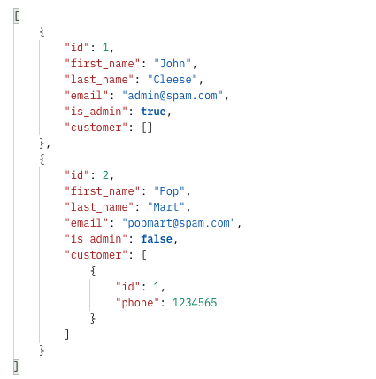
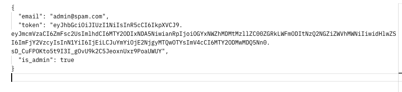
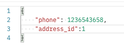
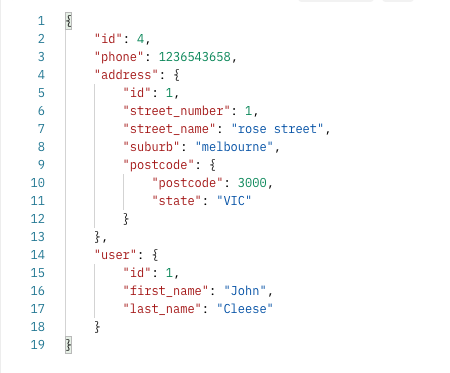
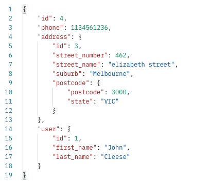
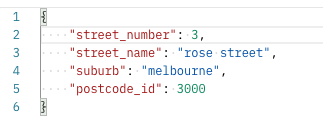
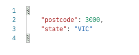
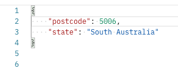
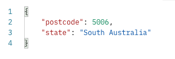

# API Endpoint Documentation

## User routes:

---

* /user/
  * Methods: GET
  * Arguments: None
  * Description: Get all users' information
  * Authentication: @jwt_required
  * Authorization: Bearer token
  * Request Body: None
  * HTTP Code: 200
  * Response Body:
    

* /user/<int:user_id>/
  * Methods: GET
  * Arguments: user_id
  * Description: Get information of the user with the specified user_id
  * Authentication: @jwt_required
  * Authorization: Bearer token
  * Request Body: None
  * HTTP Code: 200
  * Response Body:
    

* /user/update/
  * Methods: PUT, PATCH
  * Arguments: None
  * Description: Update one user's information
  * Authentication: @jwt_required
  * Authorization: None
  * Request Body:
    
  * HTTP Code: 200
  * Response Body:
    

* /user/<int:user_id>/
  * Methods: DELETE
  * Arguments: user_id
  * Description: Delete the user with the specified user_id
  * Authentication: @jwt_required
  * Authorization: Bearer token
  * Request Body: None
  * HTTP Code: 200
  * Response Body:
    

* /user/register/
  * Methods: POST
  * Arguments: None
  * Description: Register user
  * Authentication: None
  * Authorization: None
  * Request Body: 
    
  * HTTP Code: 201
  * Response Body:
    

* /user/login/
  * Methods: POST
  * Arguments: None
  * Description: User login
  * Authentication: None
  * Authorization: None
  * Request Body:
    
  * HTTP Code: 200
  * Response Body:
    

* /user/customer/
  * Methods: POST
  * Arguments: None
  * Description: Customer registration
  * Authentication: @jwt_required
  * Authorization: None
  * Request Body:
    
  * HTTP Code: 201
  * Response Body:
    

* /user/customer/
  * Methods: GET
  * Arguments: None
  * Description: Get all customers' information
  * Authentication: @jwt_required
  * Authorization: Bearer token
  * Request Body: None
  * HTTP Code: 200
  * Response Body:
    

* /user/customer/<int:customer_id/>
  * Methods: GET
  * Arguments: customer_id
  * Description: Get single customer's information
  * Authentication: @jwt_required
  * Authorization: Bearer token
  * Request Body: None
  * HTTP Code: 200
  * Response Body:
    

* /user/customer/update/phone/
  * Methods: PUT, PATCH
  * Arguments: None
  * Description: Update customer's phone number
  * Authentication: @jwt_required
  * Authorization: None
  * Request Body:
    
  * HTTP Code: 200
  * Response Body:
    

* /user/customer/update/address/
  * Methods: PUT, PATCH
  * Arguments: None
  * Description: Update customer's address
  * Authentication: @jwt_required
  * Authorization: None
  * Request Body:
    
  * HTTP Code: 200
  * Response Body:
    

* /user/customer/address/
  * Methods: GET
  * Arguments: None
  * Description: Get all addresses
  * Authentication: @jwt_required
  * Authorization: Bearer token
  * Request Body: None
  * HTTP Code: 200
  * Response Body:
    
  
* /user/customer/address/
  * Methods: POST
  * Arguments: None
  * Description: Create a new address
  * Authentication: @jwt_required
  * Authorization: None
  * Request Body:
    
  * HTTP Code: 201
  * Response Body:
    

* /user/customer/address/<int:address_id>/
  * Methods: GET
  * Arguments: address_id
  * Description: Get information of an address
  * Authentication: @jwt_required
  * Authorization: Bearer token
  * Request Body: None
  * HTTP Code: 200
  * Response Body:
    

* /user/customer/address/postcode/
  * Methods: GET
  * Arguments: None
  * Description: Get all postcodes' information
  * Authentication: @jwt_required
  * Authorization: Bearer token
  * Request Body: None
  * HTTP Code: 200
  * Response Body:
  

* /user/customer/address/postcode/<int:postcode_id>/
  * Methods: GET
  * Arguments: postcode_id
  * Description: Get information of a postcode
  * Authentication: @jwt_required
  * Authorization: Bearer token
  * Request Body: None
  * HTTP Code: 200
  * Response Body:
    

* /user/customer/address/postcode/
  * Methods: POST
  * Arguments: None
  * Description: Create a new postcode
  * Authentication: @jwt_required
  * Authorization: Bearer token
  * Request Body:
    
  * HTTP Code: 200
  * Response Body:
    

## Error handling

* 400
* Key Error
* DataError
* 404
* 401
* Validation Error