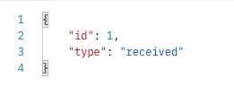
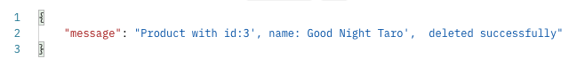
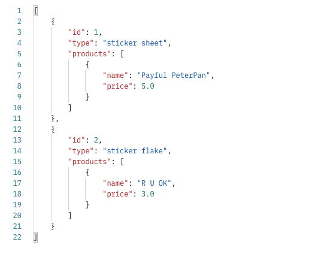
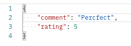
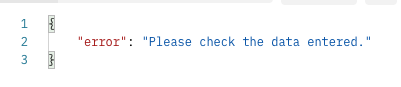

# API Endpoint Documentation

## User routes:

---

* /user/
  * Methods: GET
  * Arguments: None
  * Description: Get all users' information
  * Authentication: @jwt_required
  * Authorization: Bearer token
  * Request Body: None
  * HTTP Code: 200
  * Response Body:
  
    

* /user/<int:user_id>/
  * Methods: GET
  * Arguments: user_id
  * Description: Get information of the user with the specified user_id
  * Authentication: @jwt_required
  * Authorization: Bearer token
  * Request Body: None
  * HTTP Code: 200
  * Response Body:
    

* /user/update/
  * Methods: PUT, PATCH
  * Arguments: None
  * Description: Update one user's information
  * Authentication: @jwt_required
  * Authorization: None
  * Request Body:
  
    
  * HTTP Code: 200
  * Response Body:
  
    

* /user/<int:user_id>/
  * Methods: DELETE
  * Arguments: user_id
  * Description: Delete the user with the specified user_id
  * Authentication: @jwt_required
  * Authorization: Bearer token
  * Request Body: None
  * HTTP Code: 200
  * Response Body:
  
    

* /user/register/
  * Methods: POST
  * Arguments: None
  * Description: Register user
  * Authentication: None
  * Authorization: None
  * Request Body: 
  
    
  * HTTP Code: 201
  * Response Body:
  
    

* /user/login/
  * Methods: POST
  * Arguments: None
  * Description: User login
  * Authentication: None
  * Authorization: None
  * Request Body:
  
    
  * HTTP Code: 200
  * Response Body:
  
    

* /user/customer/
  * Methods: POST
  * Arguments: None
  * Description: Customer registration
  * Authentication: @jwt_required
  * Authorization: None
  * Request Body:
  
    
  * HTTP Code: 201
  * Response Body:
  
    

* /user/customer/
  * Methods: GET
  * Arguments: None
  * Description: Get all customers' information
  * Authentication: @jwt_required
  * Authorization: Bearer token
  * Request Body: None
  * HTTP Code: 200
  * Response Body:
  
    

* /user/customer/<int:customer_id/>
  * Methods: GET
  * Arguments: customer_id
  * Description: Get single customer's information
  * Authentication: @jwt_required
  * Authorization: Bearer token
  * Request Body: None
  * HTTP Code: 200
  * Response Body:
  
    

* /user/customer/update/phone/
  * Methods: PUT, PATCH
  * Arguments: None
  * Description: Update customer's phone number
  * Authentication: @jwt_required
  * Authorization: None
  * Request Body:
  
    
  * HTTP Code: 200
  * Response Body:
  
    

* /user/customer/update/address/
  * Methods: PUT, PATCH
  * Arguments: None
  * Description: Update customer's address
  * Authentication: @jwt_required
  * Authorization: None
  * Request Body:

    
  * HTTP Code: 200
  * Response Body:
  
    

* /user/customer/address/
  * Methods: GET
  * Arguments: None
  * Description: Get all addresses
  * Authentication: @jwt_required
  * Authorization: Bearer token
  * Request Body: None
  * HTTP Code: 200
  * Response Body:
  
    
  
* /user/customer/address/
  * Methods: POST
  * Arguments: None
  * Description: Create a new address
  * Authentication: @jwt_required
  * Authorization: None
  * Request Body:
  
    
  * HTTP Code: 201
  * Response Body:
  
    

* /user/customer/address/<int:address_id>/
  * Methods: GET
  * Arguments: address_id
  * Description: Get information of an address
  * Authentication: @jwt_required
  * Authorization: Bearer token
  * Request Body: None
  * HTTP Code: 200
  * Response Body:
  
    

* /user/customer/address/postcode/
  * Methods: GET
  * Arguments: None
  * Description: Get all postcodes' information
  * Authentication: @jwt_required
  * Authorization: Bearer token
  * Request Body: None
  * HTTP Code: 200
  * Response Body:
  
  

* /user/customer/address/postcode/<int:postcode_id>/
  * Methods: GET
  * Arguments: postcode_id
  * Description: Get information of a postcode
  * Authentication: @jwt_required
  * Authorization: Bearer token
  * Request Body: None
  * HTTP Code: 200
  * Response Body:
  
    

* /user/customer/address/postcode/
  * Methods: POST
  * Arguments: None
  * Description: Create a new postcode
  * Authentication: @jwt_required
  * Authorization: Bearer token
  * Request Body:
  
    
  * HTTP Code: 201
  * Response Body:
  
    

* /user/customer/payment_account/
  * Methods: GET
  * Arguments: None
  * Description: Get all payment_account fot the customer
  * Authentication: @jwt_required
  * Authorization: None
  * Request Body: None
  * HTTP Code: 200
  * Response Body:
  
    

* /user/customer/payment_account/<int:payment_account_id>/
  * Methods: GET
  * Arguments: payment_account_id
  * Description: Get a particular payment_account
  * Authentication: @jwt_required
  * Authorization: None
  * Request Body: None
  * HTTP Code: 200
  * Response Body:
  
    

* /user/customer/payment_account/
  * Methods: POST
  * Arguments: None
  * Description: Create a new payment_account
  * Authentication: @jwt_required
  * Authorization: None
  * Request Body:
  
    
  * HTTP Code: 200
  * Response Body:
  
    

* /user/customer/payment_account/<int:payment_account_id>/
  * Methods: DELETE
  * Arguments: payment_account_id
  * Description: Delete a payment_account
  * Authentication: @jwt_required
  * Authorization: Bearer token
  * Request Body: None
  * HTTP Code: 200
  * Response Body:
  
    

## Order routes:

* /order/
  * Methods: GET
  * Arguments: None
  * Description: Get all orders' information
  * Authentication: @jwt_required
  * Authorization: Bearer token
  * Request Body: None
  * HTTP Code: 200
  * Response Body:
  
    
    
    

* /order/<int:order_id>/
  * Methods: GET
  * Arguments: order_id
  * Description: Get a single order's information
  * Authentication: @jwt_required
  * Authorization: Bearer token
  * Request Body: None
  * HTTP Code: 200
  * Response Body:
  
    

* /order/customer/
  * Methods: GET
  * Arguments: None
  * Description: Get orders for a customer
  * Authentication: @jwt_required
  * Authorization: None
  * Request Body: None
  * HTTP Code: 200
  * Response Body:
  
    
    

* /order/customer/
  * Methods: POST
  * Arguments: None
  * Description: Create a new order
  * Authentication: @jwt_required
  * Authorization: None
  * Request Body:
  
    
  * HTTP Code: 201
  * Response Body:
  
    

* /order/detail/
  * Methods: POST
  * Arguments: None
  * Description: Create a new orderdetail
  * Authentication: @jwt_required
  * Authorization: None
  * Request Body:
  
    
  * HTTP Code: 201
  * Response Body:
  
    

* /order/detail/
  * Methods: GET
  * Arguments: None
  * Description: Get all orderdetails' information
  * Authentication: @jwt_required
  * Authorization: Bearer token
  * Request Body: None
  * HTTP Code: 200
  * Response Body:
  
    

* /order/detail/<int:order_detail_id>/
  * Methods: GET
  * Arguments: order_detail_id
  * Description: Get a single orderdetail's information
  * Authentication: @jwt_required
  * Authorization: Bearer token
  * Request Body: None
  * HTTP Code: 200
  * Response Body:
  
    

* /order/status/
  * Methods: GET
  * Arguments: None
  * Description: Get all order status
  * Authentication: @jwt_required
  * Authorization: Bearer token
  * Request Body: None
  * HTTP Code: 200
  * Response Body:
  
    

* /order/status/<int:order_status_id>/
  * Methods: GET
  * Arguments: None
  * Description: Get a single order status
  * Authentication: @jwt_required
  * Authorization: Bearer token
  * Request Body: None
  * HTTP Code: 200
  * Response Body:
  
    

* /order/status/
  * Methods: POST
  * Arguments: None
  * Description: Create a new order status
  * Authentication: @jwt_required
  * Authorization: Bearer token
  * Request Body:
  
    
  * HTTP Code: 201
  * Response Body:
  
    

* /order//status/<int:order_status_id>/
  * Methods: PUT, PATCH
  * Arguments: order_status_id
  * Description: Update a order status
  * Authentication: @jwt_required
  * Authorization: Bearer token
  * Request Body:
  
    
  * HTTP Code: 200
  * Response Body:
  
    

* /order/status/<int:order_status_id>/
  * Methods: DELETE
  * Arguments: order_status_id
  * Description: Delete a order status
  * Authentication: @jwt_required
  * Authorization: Bearer token
  * Request Body: None
  * HTTP Code: 200
  * Response Body:
  
    

* /order//shipping/
  * Methods: GET
  * Arguments: None
  * Description: Get all shippingmethods' information
  * Authentication: @jwt_required
  * Authorization: Bearer token
  * Request Body: None
  * HTTP Code: 200
  * Response Body:
  
    

* /order/shipping/<int:shipping_method_id>/
  * Methods: GET
  * Arguments: shipping_method_id
  * Description: Get information of a shipping method
  * Authentication: @jwt_required
  * Authorization: Bearer token
  * Request Body: None
  * HTTP Code: 200
  * Response Body:
  
    

* /order/shipping/
  * Methods: POST
  * Arguments: None
  * Description: Create a new shipping method
  * Authentication: @jwt_required
  * Authorization: Bearer token
  * Request Body:
  
    
  * HTTP Code: 201
  * Response Body:
  
    

* /order/shipping/<int:shipping_method_id>/
  * Methods: PUT, PATCH
  * Arguments: shipping_method_id
  * Description: Update a shipping method
  * Authentication: @jwt_required
  * Authorization: Bearer token
  * Request Body:
  
    
  * HTTP Code: 200
  * Response Body:
  
    

* /order/shipping/<int:shipping_method_id>/
  * Methods: DELETE
  * Arguments: shipping_method_id
  * Description: Delete a shipping method
  * Authentication: @jwt_required
  * Authorization: Bearer token
  * Request Body: None
  * HTTP Code: 200
  * Response Body:
  
    

## Product routes:

* /product/
  * Methods: GET
  * Arguments: None
  * Description: Get all products' information
  * Authentication: @jwt_required
  * Authorization: None
  * Request Body: None
  * HTTP Code: 200
  * Response Body:
  
    

* /product/<int:product_id>/
  * Methods: GET
  * Arguments: product_id
  * Description: Get a single product's information
  * Authentication: @jwt_required
  * Authorization: None
  * Request Body: None
  * HTTP Code: 200
  * Response Body:
  
    

* /product/
  * Methods: POST
  * Arguments: None
  * Description: Create a new product
  * Authentication: @jwt_required
  * Authorization: Bearer token
  * Request Body:
  
    
  * HTTP Code: 201
  * Response Body:
  
    

* /product/<int:product_id>/
  * Methods: PUT, PATCH
  * Arguments: product_id
  * Description: Update a product
  * Authentication: @jwt_required
  * Authorization: Bearer token
  * Request Body:
  
    
  * HTTP Code: 200
  * Response Body:
  
    

* /product/<int:product_id>/
  * Methods: DELETE
  * Arguments: product_id
  * Description: Delete a product
  * Authentication: @jwt_required
  * Authorization: Bearer token
  * Request Body: None
  * HTTP Code: 200
  * Response Body:
  
    

* /product/category/
  * Methods: GET
  * Arguments: None
  * Description: Get all categories' information
  * Authentication: @jwt_required
  * Authorization: None
  * Request Body: None
  * HTTP Code: 200
  * Response Body:
  
    

* /product/category/<int:category_id>/
  * Methods: GET
  * Arguments: category_id
  * Description: Get a category's information
  * Authentication: @jwt_required
  * Authorization: None
  * Request Body: None
  * HTTP Code: 200
  * Response Body:
  
    

* /product/category/
  * Methods: POST
  * Arguments: None
  * Description: Create a category
  * Authentication: @jwt_required
  * Authorization: Bearer token
  * Request Body:
  
    
  * HTTP Code: 201
  * Response Body:
  
    

* /product/category/<int:category_id>/
  * Methods: PUT, PATCH
  * Arguments: category_id
  * Description: Update a category
  * Authentication: @jwt_required
  * Authorization: Bearer token
  * Request Body:
  
  
  * HTTP Code: 200
  * Response Body:
  
    

* /product/category/<int:category_id>/
  * Methods: DELETE
  * Arguments: category_id
  * Description: Delete a category
  * Authentication: @jwt_required
  * Authorization: Bearer token
  * Request Body: None
  * HTTP Code: 200
  * Response Body:
  
    

* /product/<int:product_id_entered>/review/
  * Methods: GET
  * Arguments: product_id_entered
  * Description: Get all reviews of a product
  * Authentication: @jwt_required
  * Authorization: None
  * Request Body: None
  * HTTP Code: 200
  * Response Body:
  
    

* /product/<int:product_id_entered>/review/<int:review_id>/
  * Methods: GET
  * Arguments: product_id_entered, review_id
  * Description: Get a particular review of a product
  * Authentication: @jwt_required
  * Authorization: None
  * Request Body: None
  * HTTP Code: 200
  * Response Body:
  
    

* /product/<int:product_id_entered>/review/
  * Methods: POST
  * Arguments: product_id_entered
  * Description: Create a reivew for the product
  * Authentication: @jwt_required
  * Authorization: None
  * Request Body:
  
    
  * HTTP Code: 201
  * Response Body:
  
    

* /product/<int:product_id_entered>/review/<int:review_id>/
  * Methods: DELETE
  * Arguments: product_id_entered, review_id
  * Description: Delete a review of a product
  * Authentication: @jwt_required
  * Authorization: None
  * Request Body: None
  * HTTP Code: 200
  * Response Body:
  
    

## Error handling

* 400 - Bad request

Raise error with wrong syntax

  
* Key Error

Raise error if missing required fields, such as foreign keys

* DataError

Raise error if data entered does not follow the data type and constraints

* 404
  
Raise error when data not found

* 401

Raise error when user are not authorized to perform the operation

* Validation Error

Raise error when data validation fails

